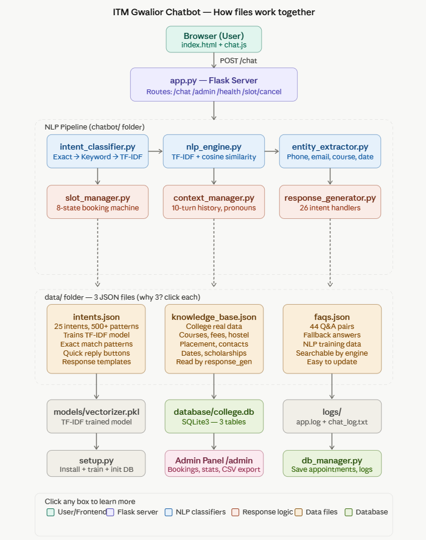

# ITM Gwalior Chatbot 🎓🤖

An intelligent, NLP-powered college enquiry and appointment booking chatbot designed specifically for ITM Gwalior. The chatbot handles student queries, provides information about courses, fees, scholarships, and allows users to seamlessly book campus visit appointments.

## 🏗️ Architecture & Flow Diagram

Here is how the different components of the chatbot work together:

*(Note: Please rename your flow diagram image to `architecture.png` and upload it to your GitHub repository so it displays here.)*

## ✨ Features
- **Natural Language Processing (NLP):** Uses TF-IDF, Cosine Similarity, and Keyword matching to classify user intents accurately.
- **Context Management:** Remembers up to 10 conversational turns and resolves pronouns for contextual awareness.
- **Entity Extraction:** Automatically extracts phone numbers, emails, course names, and dates from user messages.
- **Slot Booking Engine:** An 8-state machine that handles interactive campus visit bookings.
- **Admin Panel:** Secure dashboard to view statistics, manage appointments, and export data to CSV.
- **Data-Driven:** Easily updatable JSON files for intents, FAQs, and knowledge base.

## 📂 Project Structure (How Files Work Together)

### 1. Frontend (Browser)
- `index.html` & `chat.js`: The user interface for the chatbot.

### 2. Flask Server (`app.py`)
Acts as the main backend server connecting the frontend to the NLP pipeline.
- Routes: `/chat` (messaging), `/admin` (dashboard), `/health` (status), `/slot/cancel` (booking cancellation).

### 3. NLP Pipeline (`chatbot/` folder)
- **`intent_classifier.py`**: Identifies what the user wants (Exact Match → Keyword → TF-IDF).
- **`nlp_engine.py`**: Core engine for text processing and similarity scoring.
- **`entity_extractor.py`**: Extracts essential user information (Phone, email, course, date).
- **`slot_manager.py`**: Manages the step-by-step appointment booking flow.
- **`context_manager.py`**: Maintains conversation history.
- **`response_generator.py`**: Generates replies based on 26 distinct intent handlers.

### 4. Data Files (`data/` folder)
- **`intents.json`**: 25 intents, 500+ patterns for training the TF-IDF model.
- **`knowledge_base.json`**: Real college data (Courses, fees, placements, contacts).
- **`faqs.json`**: 44 Q&A pairs for fallback and exact matching.

### 5. Database & Storage
- **`database/college.db`**: SQLite3 database with 3 tables (Appointments, Leads, Logs).
- **`db_manager.py`**: Handles all database operations.
- **`models/vectorizer.pkl`**: The trained TF-IDF model.
- **`logs/`**: Stores `app.log` and `chat_log.txt`.

## 🚀 Deployment (Railway.app)

This project is optimized for deployment on Linux containers (like Railway) using `gunicorn`.

1. **Connect GitHub to Railway:** Choose "Deploy from GitHub repo" and select this repository.
2. **Set Root Directory:** In Railway Settings, set the Root Directory to `college_chatbot`.
3. **Environment Variables:**
   - `FLASK_SECRET_KEY`: Your secure secret key
   - `ADMIN_USERNAME`: Admin login username
   - `ADMIN_PASSWORD`: Admin login password
4. The included `Procfile` (`web: gunicorn app:app`) and NLTK auto-downloader in `app.py` will handle the rest automatically!

## 🛠️ Local Setup
1. Clone the repository.
2. Navigate to the project directory: `cd college_chatbot`
3. Install dependencies: `pip install -r requirements.txt`
4. Run the setup script to initialize the database and train the model: `python setup.py`
5. Start the server: `python app.py`
